<!--more-->

<section class="hero">
  

    

      

        

          <h1 class="title is-1 publication-title">Referring Layer Decomposition</h1>
          <!--   -->
          

            
              <a href="https://fangyi-chen.github.io/">Fangyi Chen</a>,
            
              <a href="https://yaojie-shen.github.io">Yaojie Shen</a>,
            
              <a href="https://www.linkedin.com/in/lu-xu-34b200160/">Lu Xu</a>,
            
              <a href="https://scholar.google.com/citations?user=L0W1LjMAAAAJ&hl=en">Ye Yuan</a>,
            
              <a href="https://scholar.google.com/citations?user=k9zsuBIAAAAJ&hl=en">Shu Zhang</a>,
            
              <a href="https://yuleiniu.github.io/">Yulei Niu</a>,
            
              <a href="https://scholar.google.com/citations?user=PO9WFl0AAAAJ&hl=en">Longyin Wen</a>
          

          

            Intelligent Editing Team, Intelligent Creation, ByteDance Inc.
          

          

            

              
                <a href="https://iclr.cc/virtual/2026/poster/10011003" class="external-link button is-normal is-rounded is-dark">
                  
                    <i class="fas fa-file-pdf"></i>
                  
                  Paper
                </a>
              
              
                <a href="https://arxiv.org/abs/" class="external-link button is-normal is-rounded is-dark">
                  
                    <i class="ai ai-arxiv"></i>
                  
                  arXiv
                </a>
              
              
                <a href="https://iclr.cc/virtual/2026/poster/10011003" class="external-link button is-normal is-rounded is-dark">
                  
                    <i class="fab fa-github"></i>
                  
                  Code (coming soon)
                </a>
              
            

          

        

      

    

  

</section>

</head>

<body>

  

    <h3>Original</h3>
    
  

  

    <h3>Prompt</h3>
    
  

  

    
RefLayer

    
→

  

  

    <h3>Layered Result</h3>
    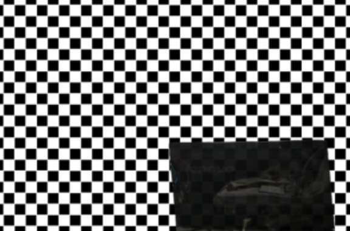
  

<section class="section">
  

    

      

        <h2 class="title is-3">Abstract</h2>
        

          

Precise, object-aware control over visual content is essential for advanced image editing and compositional generation. Yet, most existing approaches operate on entire images holistically, limiting the ability to isolate and manipulate individual scene elements. In contrast, layered representations, where scenes are explicitly separated into objects, environmental context, and visual effects, provide a more intuitive and structured framework for interpreting and editing visual content. 
To bridge this gap and enable both compositional understanding and controllable editing, we introduce the Referring Layer Decomposition (RLD) task, which predicts complete RGBA layers from a single RGB image, conditioned on flexible user prompts, such as spatial inputs (<i>e.g.</i>, points, boxes, masks), natural language descriptions, or combinations thereof.
At the core is the RefLade, a large-scale dataset comprising 1.11M image–layer–prompt triplets produced by our scalable data engine, along with 100K manually curated, high-fidelity layers. Coupled with a perceptually grounded, human-preference-aligned automatic evaluation protocol, RefLade establishes RLD as a well-defined and benchmarkable research task.
Building on this foundation, we present RefLayer, a simple baseline designed for prompt-conditioned layer decomposition, achieving high visual fidelity and semantic alignment.
Extensive experiments show our approach enables effective training, reliable evaluation, and high-quality image decomposition, while exhibiting strong zero-shot generalization capabilities.
          

        

      

    

  

</section>

<section class="section">
  

    

      

        <h3 class="title is-3">RefLade: Data Engine, Dataset and Evaluation Protocol</h3>
        <h4 class="title is-4">Data Engine</h4>
          

            

            We introduce a scalable and modular automated data engine capable of generating diverse, realistic, and high-fidelity RGBA layers from natural images at scale.
            

          

          

            

              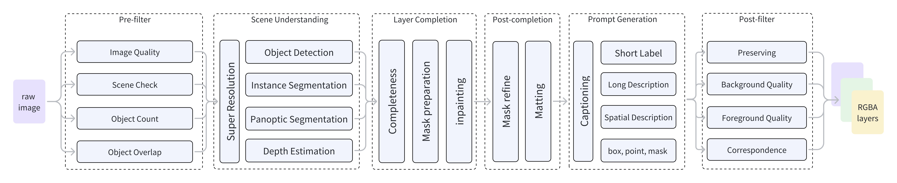
              <h2 class="subtitle has-text-centered">
                Overview of the data engine
              </h2>
            

          

        <h4 class="title is-4">Dataset</h4>
        

          

            

              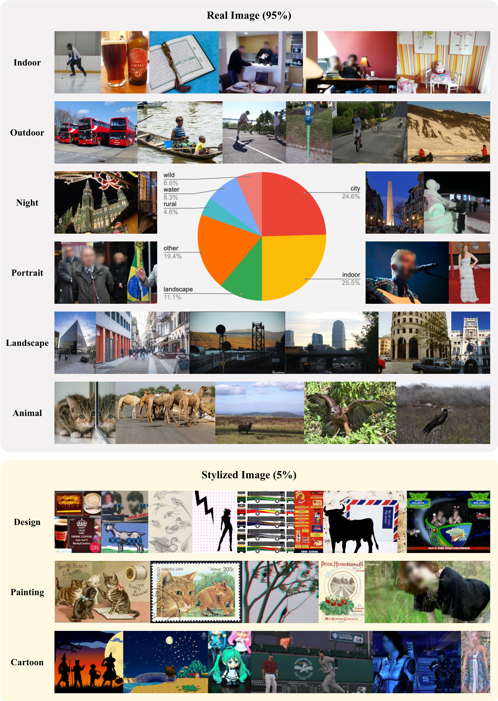
              
Image source

            

          

          

            

              <table style="font-size: 0.8em;">
                <tr>
                  <td><b>Dataset</b></td>
                  <td><b>Task</b></td>
                  <td><b># Images</b></td>
                  <td><b>Average Resolutions</b></td>
                  <td><b># Cls</b></td>
                  <td><b># Instances</b></td>
                  <td><b>Occlusion Rate</b></td>
                  <td><b>Image Source</b></td>
                </tr>
                <tr>
                  <td>SAIL-VOS</td>
                  <td>Amodal</td>
                  <td>111,654</td>
                  <td>800×1280</td>
                  <td>162</td>
                  <td>1,896,296</td>
                  <td>56.3%</td>
                  <td>Synthetic</td>
                </tr>
                <tr>
                  <td>OVD</td>
                  <td>Amodal</td>
                  <td>34,100</td>
                  <td>500×375</td>
                  <td>196</td>
                  <td>-</td>
                  <td>-</td>
                  <td>Real</td>
                </tr>
                <tr>
                  <td>WALT</td>
                  <td>Amodal</td>
                  <td>15M</td>
                  <td>-</td>
                  <td>2</td>
                  <td>36M</td>
                  <td>-</td>
                  <td>Real</td>
                </tr>
                <tr>
                  <td>AHP</td>
                  <td>Amodal</td>
                  <td>56,599</td>
                  <td>-</td>
                  <td>1</td>
                  <td>56,599</td>
                  <td>-</td>
                  <td>Real</td>
                </tr>
                <tr>
                  <td>DYCE</td>
                  <td>Amodal</td>
                  <td>5,500</td>
                  <td>1000×1000</td>
                  <td>79</td>
                  <td>85,975</td>
                  <td>27.7%</td>
                  <td>Real</td>
                </tr>
                <tr>
                  <td>OMLD</td>
                  <td>Amodal</td>
                  <td>13,000</td>
                  <td>384×512</td>
                  <td>40</td>
                  <td>-</td>
                  <td>-</td>
                  <td>Synthetic</td>
                </tr>
                <tr>
                  <td>CSD</td>
                  <td>Amodal</td>
                  <td>11,434</td>
                  <td>512×512</td>
                  <td>40</td>
                  <td>129,336</td>
                  <td>26.3%</td>
                  <td>Synthetic</td>
                </tr>
                <tr>
                  <td>MuLAn</td>
                  <td>LD</td>
                  <td>44,860</td>
                  <td>-</td>
                  <td>759</td>
                  <td>101,269</td>
                  <td>7.7%</td>
                  <td>Real</td>
                </tr>
                <tr class="ours">
                  <td><b>RefLade</b></td>
                  <td><b>RLD</b></td>
                  <td><b>430,488</b></td>
                  <td><b>1831×1437</b></td>
                  <td><b>12K</b></td>
                  <td><b>871,829</b></td>
                  <td><b>60.8%</b></td>
                  <td><b>Real</b></td>
                </tr>
              </table>
              
Comparison of RefLade with related existing datasets

            

            

              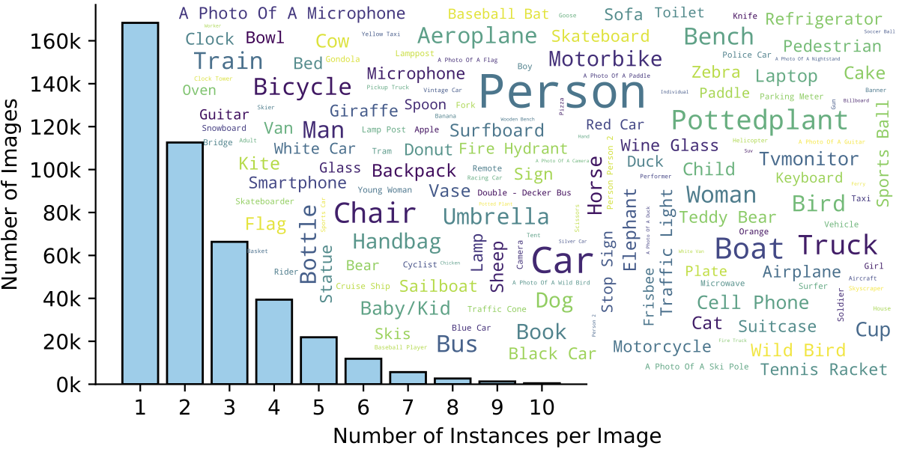
              
Instance distribution of RefLade Dataset

            

          

        

        <!-- Evaluation Protocol -->
        <h4 class="title is-4">Evaluation Protocol</h4>
        

          

            <h5 class="title is-5">The HPA (Human
Preference Aligned) Score</h5>
            

              

                Following human judgment, we evaluate the decomposition quality from three aspects:
              

              

                <b>Aspect 1: Preservation. </b>Preserving original visible content.
                 
              

              

                \[\mathcal{S}_{\text{vis}} = \mathbb{E}_{(p, g) \sim \mathcal{D}} [ \text{LPIPS}(g_{\text{rgb}} \odot g_v,\, p_{\text{rgb}} \odot g_v) ] \]
              

              

                <b>Aspect 2: Completion.</b> Generating reasonable completions for the occluded regions.
                 
              

              

                \[\mathcal{S}_{\text{gen}} = \mathbb{E}_{(p, g) \sim \mathcal{D}} \left[\cos\left( f(g_{\text{rgb}}) - f(g_{\text{rgb}} \odot g_v), \,f(p_{\text{rgb}}) - f(g_{\text{rgb}} \odot g_v) \right)\right]\]
              

              

                <b>Aspect 3: Faithfulness.</b> The distributional similarity between predictions and ground-truth layers.
                 
              

              

                \[\hat{p} = p_{\text{rgb}} \odot p_a + i_{\text{bkgd}} \odot (1 - p_a), \quad
  \hat{g} = g_{\text{rgb}} \odot g_a + i_{\text{bkgd}} \odot (1 - g_a)\]
  \[\mathcal{S}_{\text{fid}} = \text{FID}\left( \left\{ \hat{p} \mid p \in \mathcal{D} \right\}, \left\{ \hat{g} \mid g \in \mathcal{D} \right\} \right)\]
              

              

                <b>Aggregation.</b> We apply min-max normalization to each metric and then averaging them to produce the final HPA score.
              

            

          

          

            <h5 class="title is-5">Alignment with Human Preference</h5>
            

              

                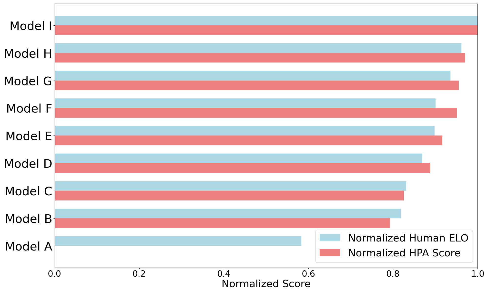
                
Human ELO vs. the HPA Score

              

              <!-- 

                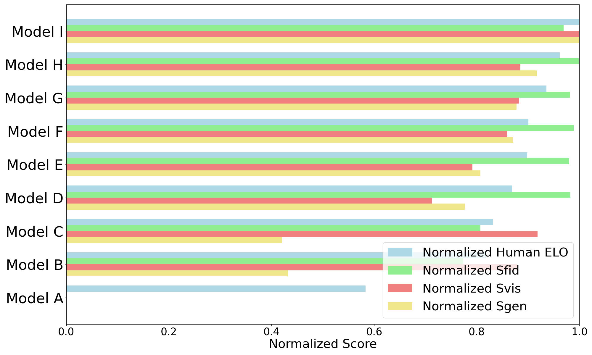
                
Human ELO vs. Svis, Sfid, and Sgen

              
 -->
              

                <table style="font-size: 0.9em;">
                  <tr>
                    <td><b></b></td>
                    <td><b>HPA</b></td>
                    <td><b>Svis</b></td>
                    <td><b>Sgen</b></td>
                    <td><b>Sfid</b></td>
                    <td><b>Svis + Sgen</b></td>
                    <td><b>Sfid + Sgen</b></td>
                    <td><b>Svis + Sfid</b></td>
                  </tr>
                  <tr>
                    <td><b>Pearson correlation</b></td>
                    <td>0.96</td>
                    <td>0.90</td>
                    <td>0.96</td>
                    <td>0.94</td>
                    <td>0.95</td>
                    <td>0.95</td>
                    <td>0.94</td>
                  </tr>
                  <tr>
                    <td><b>Spearman correlation</b></td>
                    <td>1</td>
                    <td>0.60</td>
                    <td>0.98</td>
                    <td>0.67</td>
                    <td>0.92</td>
                    <td>0.97</td>
                    <td>1</td>
                  </tr>
                </table>
                
Pearson and Spearman correlations with human ELO across different metrics

              

            

          

        

      

    

  

   
</section>

<section class="section">
  

    

      

        <h3 class="title is-3">RefLayer: A Baseline Model</h3>
        

          To establish a baseline, we formulate RLD as a conditional image generation problem and employ two decoders—a standard RGB decoder and a custom alpha decoder—to reconstruct the RGB content and the alpha transparency mask from the latent representation.
        

        

          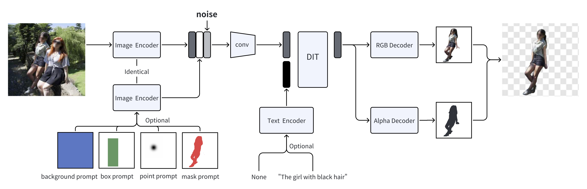
          

            RefLayer model architecture.
          

        

        

          <table style="font-size: 0.9em;">
            <tr>
              <td rowspan="2"><b>Dataset</b></td>
              <td rowspan="2"><b>#layers</b></td>
              <td colspan="4"><b>Foreground</b></td>
              <td colspan="4"><b>Background</b></td>
            </tr>
            <tr>
              <td><b>HPA &uarr;</b></td>
              <td><b>FID &darr;</b></td>
              <td><b>LPIPS &darr;</b></td>
              <td><b>DIR &uarr;</b></td>
              <td><b>HPA &uarr;</b></td>
              <td><b>FID &darr;</b></td>
              <td><b>LPIPS &darr;</b></td>
              <td><b>DIR &uarr;</b></td>
            </tr>
            <tr>
              <td>MuLAn</td>
              <td>50K</td>
              <td>0.3852</td>
              <td>22.68</td>
              <td>0.1403</td>
              <td>0.2031</td>
              <td>0.3459</td>
              <td>21.84</td>
              <td>0.1588</td>
              <td>0.6385</td>
            </tr>
            <tr>
              <td>RefLade</td>
              <td>50K</td>
              <td>0.4629</td>
              <td>10.98</td>
              <td>0.1411</td>
              <td>0.2543</td>
              <td>0.5932</td>
              <td>16.87</td>
              <td>0.0520</td>
              <td>0.7206</td>
            </tr>
            <tr>
              <td>RefLade</td>
              <td>100K</td>
              <td>0.4621</td>
              <td>11.27</td>
              <td>0.1428</td>
              <td>0.2589</td>
              <td>0.5935</td>
              <td>16.73</td>
              <td>0.0530</td>
              <td>0.7213</td>
            </tr>
            <tr>
              <td>RefLade</td>
              <td>200K</td>
              <td>0.4631</td>
              <td>10.99</td>
              <td>0.1434</td>
              <td>0.2547</td>
              <td>0.5461</td>
              <td>19.84</td>
              <td>0.0552</td>
              <td>0.6950</td>
            </tr>
            <tr>
              <td>RefLade</td>
              <td>400K</td>
              <td>0.4678</td>
              <td>10.66</td>
              <td>0.1404</td>
              <td>0.2575</td>
              <td>0.5792</td>
              <td>18.36</td>
              <td>0.0493</td>
              <td>0.7129</td>
            </tr>
            <tr>
              <td>RefLade</td>
              <td>1M</td>
              <td>0.4685</td>
              <td>11.10</td>
              <td>0.1377</td>
              <td>0.2561</td>
              <td>0.5587</td>
              <td>17.35</td>
              <td>0.0730</td>
              <td>0.7190</td>
            </tr>
            <tr>
              <td>RefLadeQ</td>
              <td>100K</td>
              <td>0.4698</td>
              <td>10.60</td>
              <td>0.1378</td>
              <td>0.2531</td>
              <td>0.6657</td>
              <td>12.99</td>
              <td>0.0487</td>
              <td>0.7721</td>
            </tr>
            <tr class="ours">
              <td><b>RefLade+Q</b></td>
              <td><b>1.1M</b></td>
              <td><b>0.4813</b></td>
              <td>10.50</td>
              <td>0.1330</td>
              <td>0.2652</td>
              <td><b>0.6682</b></td>
              <td>13.14</td>
              <td>0.0437</td>
              <td>0.7673</td>
            </tr>
          </table>
        

        <h2 class="subtitle has-text-centered">
          Benchmarking RefLade with Different Training Set and Scale. Results are reported on the RefLade testing set with multimodal text+box prompts.
        </h2>
      

    

  

   
</section>

<section class="section">
  

    <h3 class="title is-3">Qualitative Results</h3>
    

      

        <!-- More -->
        

          

            

              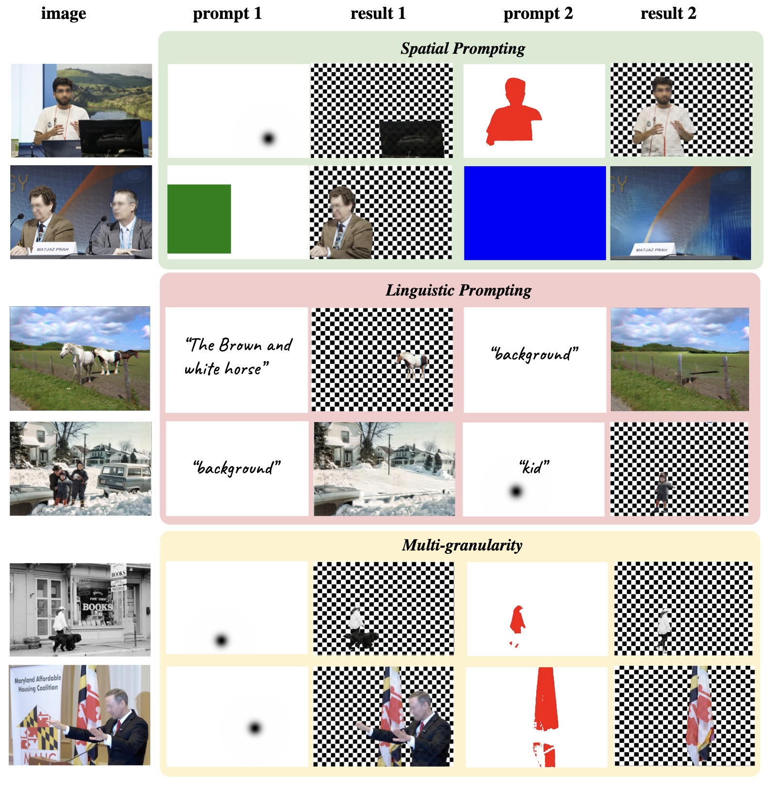
            

          

          

            

              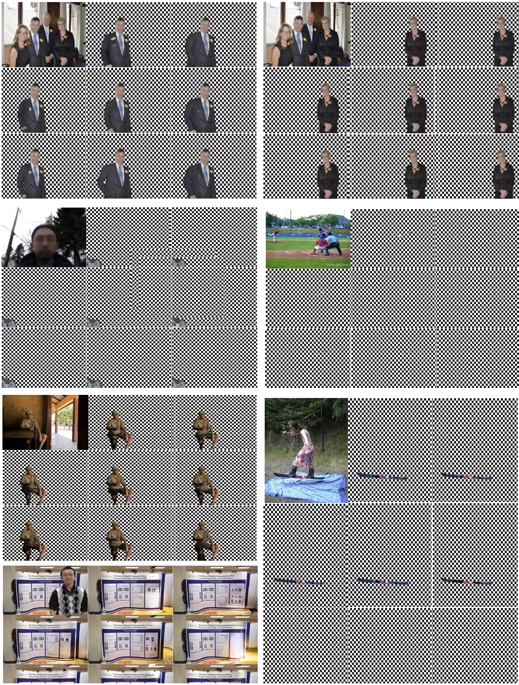
            

          

        

        <!-- Model Comparison -->
        

          

            <h4 class="title is-4">Model Comparison</h4>
            

              We compare our RefLayer, trained on the RefLade dataset, with the same model trained on the MuLAn dataset and with Google Gemini 3 (Nano Banana Pro). Our model generally produces higher-quality predictions. The latest general-purpose generative models (Nano Banana Pro) have limitations in preservation and completion, and cannot produce true RGBA images with an alpha channel.
            

          

        

        <!-- Img -->
        

          <!-- RLD vs MuLAn -->
          

            

              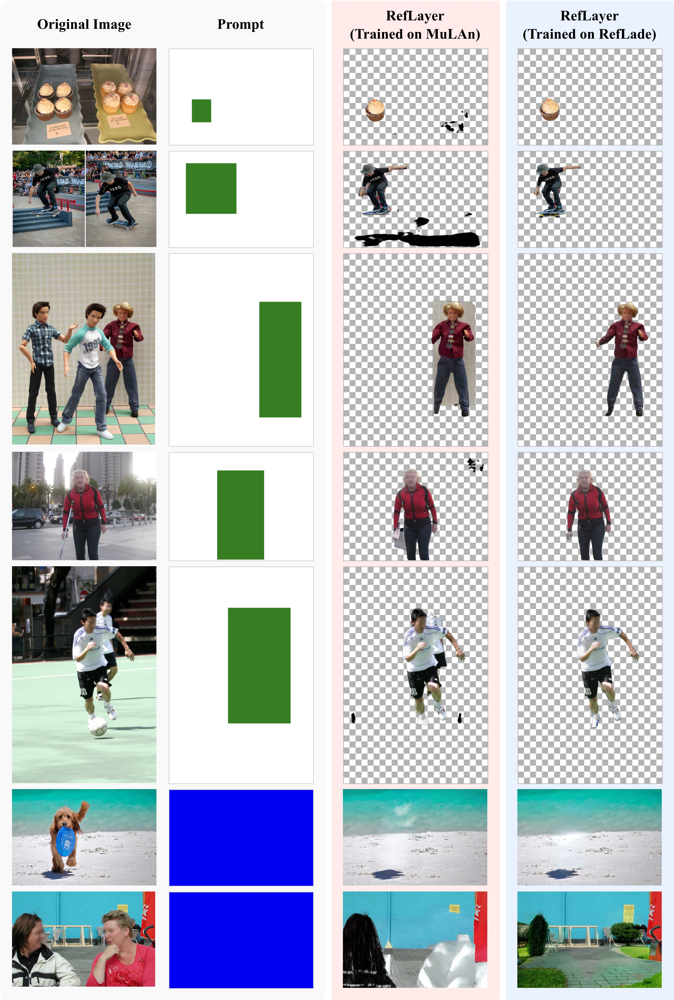
              

                Comparison between RefLayer trained on the MuLAn dataset and the same model trained on our RefLade dataset.
              

            

          

          <!-- RLD vs Google Gemini 3 (Nano Banana Pro) -->
          

            

              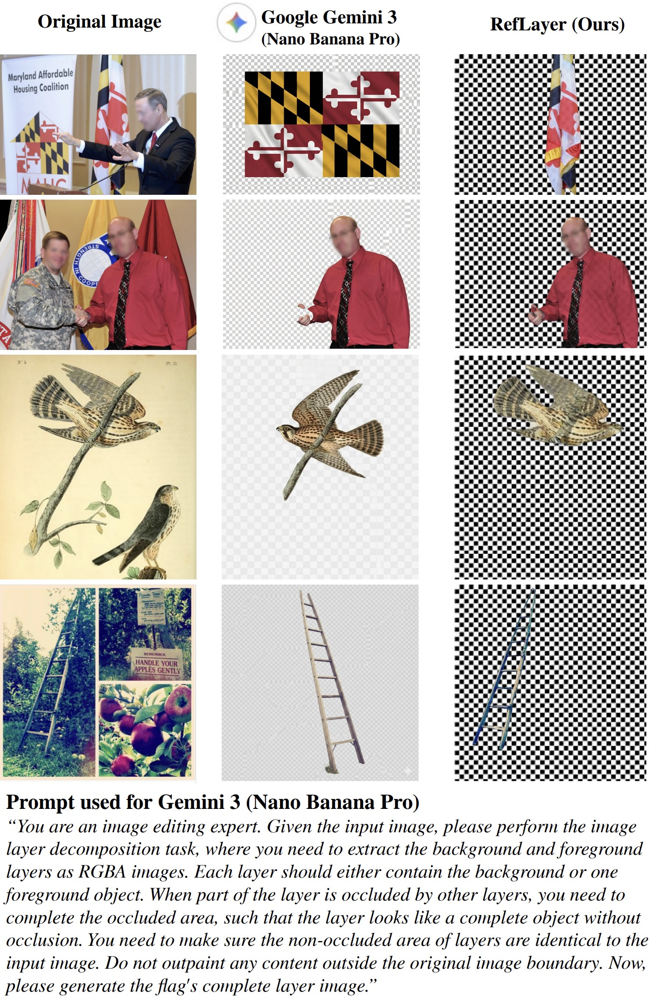
              

                Comparison between RefLayer and Google Gemini 3 (Nano Banana Pro).
              

            

          

        

      

    

  

</section>

<section class="section" id="BibTeX">
  

        <h3 class="title is-3">BibTeX</h3>
        <pre><code>@inproceedings{rld,
    title     = {Referring Layer Decomposition},
    author    = {Chen, Fangyi and Shen, Yaojie and Xu, Lu and Yuan, Ye and Zhang, Shu and Niu, Yulei and Wen, Longyin},
    booktitle = {ICLR 2026 (Virtual)},
    year      = {2026},
    url       = {https://iclr.cc/virtual/2026/poster/10011003}
}</code></pre>
  

</section>

